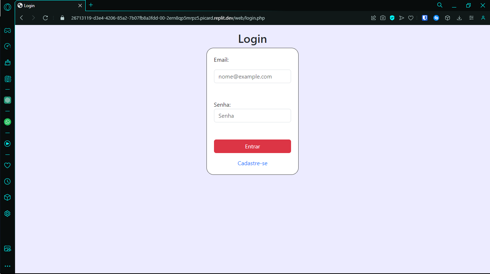
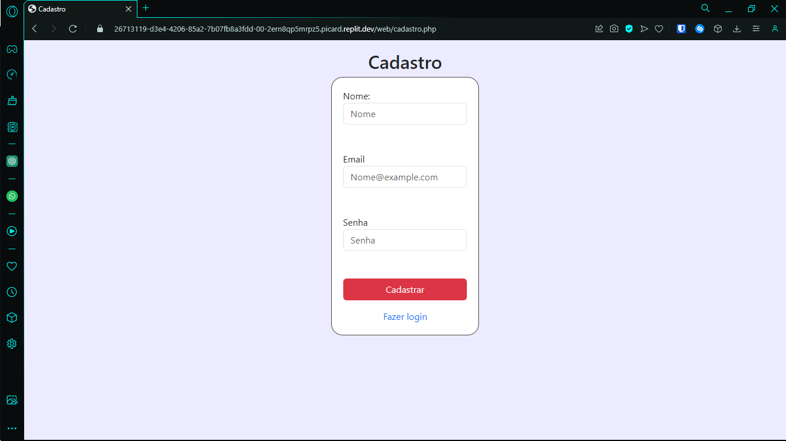
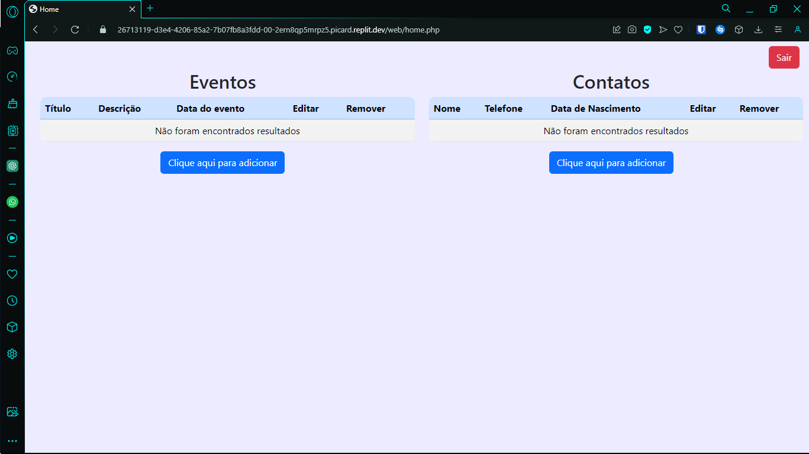
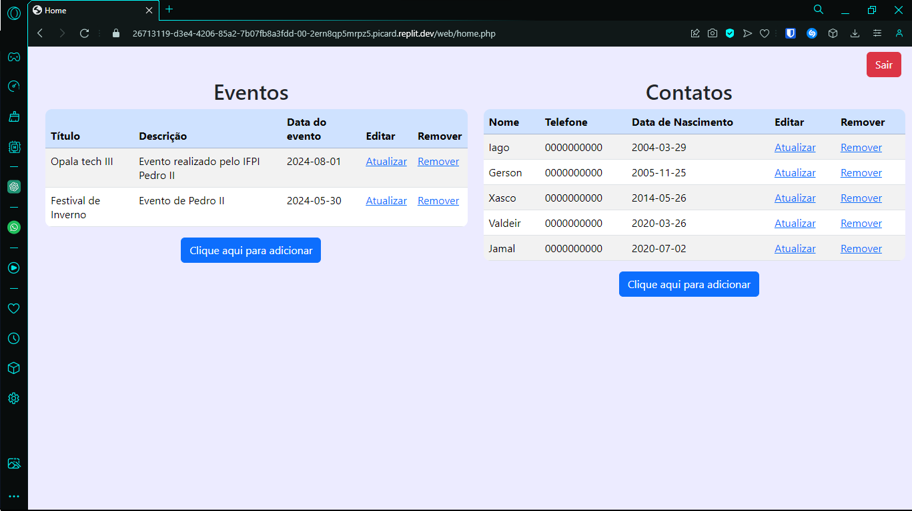
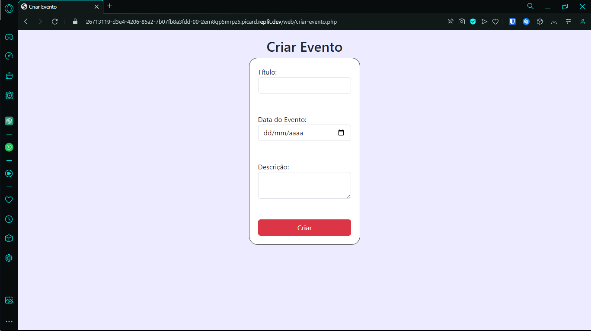
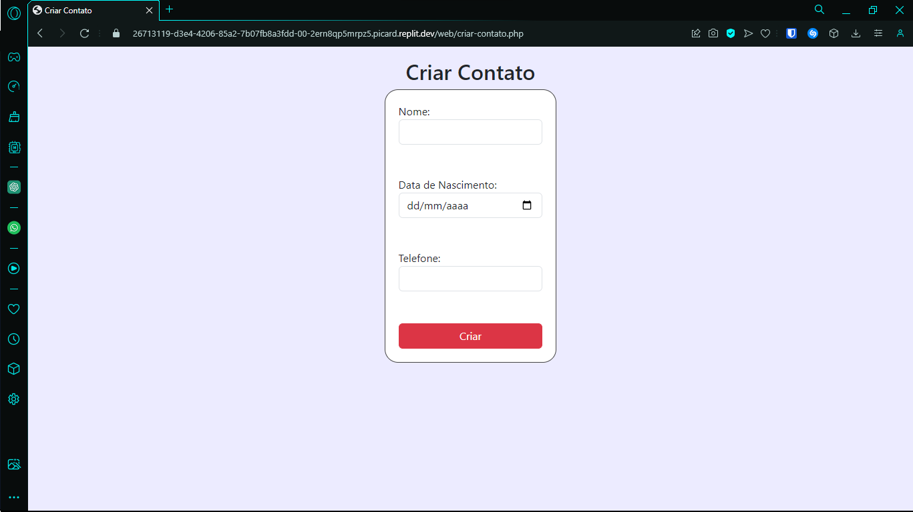

<h1 align="center"> CRUD com PHP 🐘</h1>

  
  
  

# Índices 🗂
* [Sobre](#sobre-)
* [Screenshots](#screenshots-)

# Sobre ☄

O projeto foi realizado em grupo para praticar os conhecimentos de PHP.
No projeto, foi realizada a criação de um sistema de agenda. O sistema possui login. Dessa forma, diferentes usuários conseguem acessar a plataforma e acessar suas agendas de formas individuais.
O sistema também conta com o uso de cookies. Então, caso o usuário precise retornar novamente ao site o seu acesso já vai estar liberado.

# Screenshots 📸

Criado por [Iago Amorim](https://github.com/danonep2), [Artur Rodrigues](https://github.com/ArturRDGS), [Milleny Mesquita](https://github.com/MillenyMesquita), [Fabrício Andrade](https://github.com/andradejs) e [Henrique Ferreira](https://github.com/andradejs).

